# T2MBench

T2MBench is a text-to-motion benchmark organized around diverse instruction types and prompt-level model comparisons.

## Representative Prompt-level Comparisons

The examples below provide a small set of prompt-level comparisons across 14 text-to-motion models. Due to the large scale of the generated data and related intellectual property considerations, we kindly note that the complete data package will be released after the paper is accepted.

### T2MB_0276 - Complexity / Multi-stage

**Prompt:** The body slowly squats down with both arms hanging naturally. After pausing briefly at the lowest point, it gradually stands back up. Once fully upright, the right foot steps half a step forward, and the body then returns to the initial standing posture.

Each model block shows a directly embedded GIF preview.

#### HY

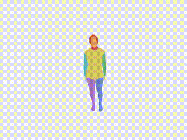

#### ViGen

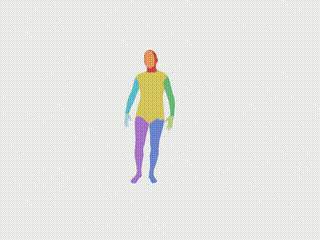

#### MotionGPT

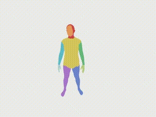

#### T2M

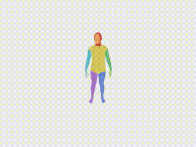

#### MDM

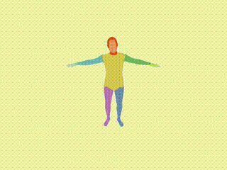

#### MMM

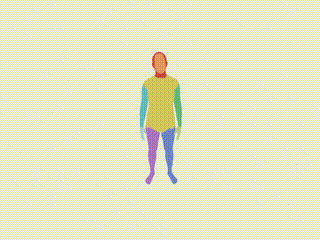

#### CLoSD

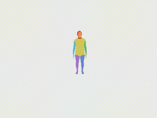

#### AvatarGPT

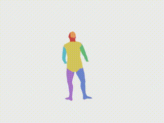

#### DART

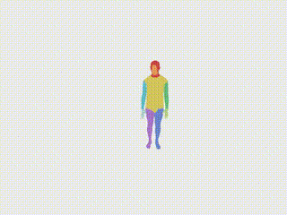

#### PriorMDM

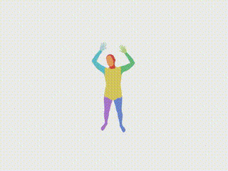

#### MoGenTS

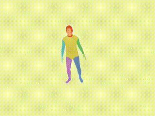

#### MoMask

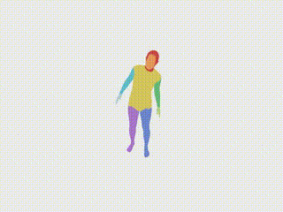

#### SALAD

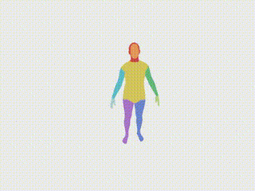

#### MaskControl

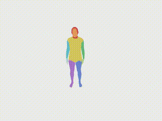

### T2MB_0646 - Interaction / Invisible-object interaction

**Prompt:** The person extends both arms forward and slightly upward to reach for an invisible rope, then leans the torso backward and pulls the arms toward the chest in a rhythmic sequence as if tugging a heavy weight.

Each model block shows a directly embedded GIF preview.

#### HY

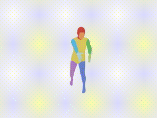

#### ViGen

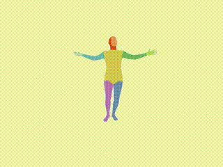

#### MotionGPT

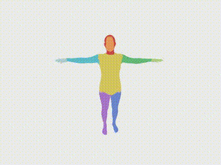

#### T2M

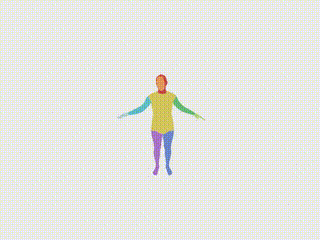

#### MDM

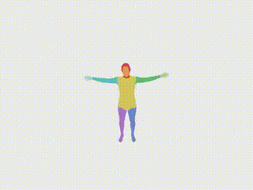

#### MMM

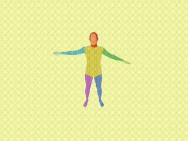

#### CLoSD

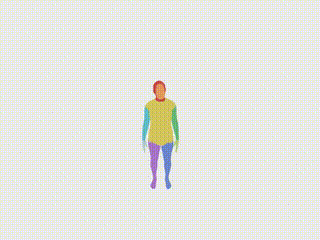

#### AvatarGPT

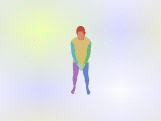

#### DART

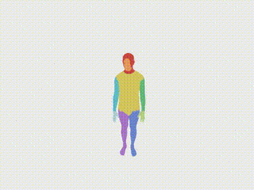

#### PriorMDM

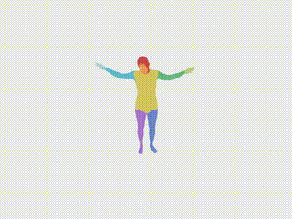

#### MoGenTS

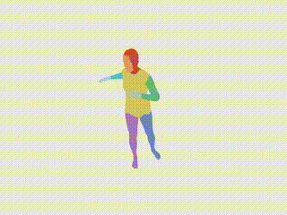

#### MoMask

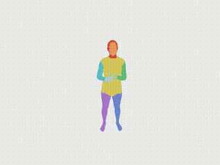

#### SALAD

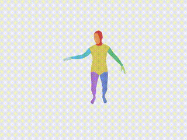

#### MaskControl

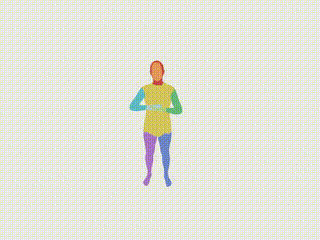

See [`examples/README.md`](examples/README.md) for the representative example index.
